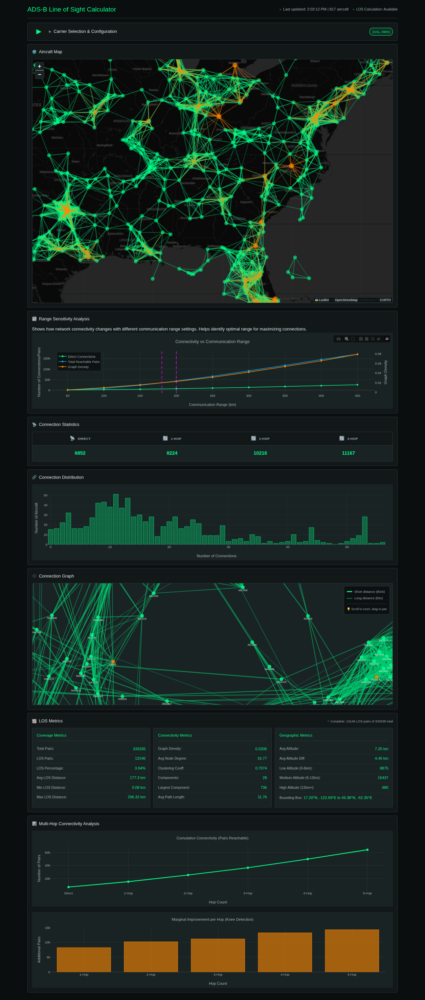

# ADS-B Line of Sight Calculator

A minimalistic web interface for calculating line-of-sight distances between aircraft from ADS-B data and analyzing multi-hop communication paths.



## Features

- Real-time aircraft data ingestion from OpenSky Network API
- Radio horizon line-of-sight distance calculations
- Multi-hop communication path analysis (direct, 1-hop, 2-hop, 3-hop)
- Carrier filtering for top 25 worldwide airlines
- Carrier-specific communication range configuration
- Automatic data refresh every 15 minutes
- Minimalistic dark theme UI with green accents
- **Interactive Leaflet map** with aircraft positions and LOS connection visualization
- **Comprehensive LOS metrics** including coverage, connectivity, and geographic statistics
- **Plotly.js visualizations** for distance and connection distributions
- **D3.js force-directed network graph** with pan/zoom capabilities
- **Range sensitivity analysis** to evaluate connectivity at different communication ranges
- **Connectivity curve analysis** showing multi-hop reachability and "knee in the curve"
- **Top 50 airports integration** for airport-to-aircraft LOS analysis
- **160 NMI LOS limit** applied to all distance calculations

## Requirements

- Python 3.8+
- pip

## Installation

1. Clone the repository:
```bash
cd LOS-calc_ADS-B
```

2. Install dependencies:
```bash
pip install -r requirements.txt
```

## Running the Application

Start the Flask development server:

```bash
python app.py
```

The application will be available at `http://localhost:5000`

## Usage

1. **Select Carriers**: Check the boxes next to the carriers you want to analyze
2. **Configure Ranges** (optional): Adjust communication ranges for each selected carrier
3. **Configure Options**:
   - **Include Airports**: Toggle to include top 50 airports in LOS analysis
4. **View Visualizations**:
   - **Connection Distribution**: See how many aircraft have each number of connections
   - **Communication Statistics**: View direct, 1-hop, 2-hop, and 3-hop connection counts in a table format
   - **Network Graph**: Explore the connectivity graph with interactive pan/zoom
   - **Aircraft Map**: View aircraft positions and LOS connections on an interactive Leaflet map
   - **LOS Metrics**: Review comprehensive coverage, connectivity, and geographic statistics
   - **Range Sensitivity Analysis**: Evaluate how connectivity metrics change across different communication ranges
   - **Connectivity Curve**: Analyze cumulative pairs reachable at each hop level and identify optimal hop counts
4. **Auto-Refresh**: Data automatically refreshes every 15 minutes, or manually refresh by changing carrier selection

## Configuration

### Carrier Communication Ranges

Carrier-specific communication ranges can be configured in the web interface. Default ranges are defined in `config.py` and can be adjusted per-carrier through the configuration panel.

### Airport Integration

The application includes the top 50 airports by aircraft traffic. Airports can be included in LOS analysis via a toggle switch. When enabled, airports are treated as ground stations and LOS distances are calculated between airports and aircraft.

### LOS Distance Limits

All LOS distance calculations are capped at 160 nautical miles (296.32 km), representing the practical limit for air-to-air communication systems.

### Top 25 Supported Carriers

- American Airlines (AAL)
- Delta Air Lines (DAL)
- United Airlines (UAL)
- Southwest Airlines (SWA)
- Lufthansa (DLH)
- British Airways (BAW)
- Air France (AFR)
- Emirates (UAE)
- Qatar Airways (QTR)
- Singapore Airlines (SIA)
- Japan Airlines (JAL)
- KLM Royal Dutch Airlines (KLM)
- Iberia (IBE)
- All Nippon Airways (ANA)
- Thai Airways (THA)
- Qantas (QFA)
- LATAM (TAM)
- Turkish Airlines (TUR)
- Etihad Airways (ETD)
- Cathay Pacific (CXA)
- China Southern (CSN)
- China Eastern (CES)
- China Airlines (CAL)
- Korean Air (KAL)
- Virgin Atlantic (VIR)

## API Endpoints

### `GET /api/aircraft`
Returns all available aircraft data filtered to top 25 carriers.

### `POST /api/distances`
Calculates distances for selected carriers.

**Request Body:**
```json
{
  "carriers": ["DAL", "UAL", "SWA"],
  "carrier_ranges": {
    "DAL": 200,
    "UAL": 200
  },
  "include_airports": true
}
```

**Response:**
```json
{
  "distances": [...],
  "aircraft_count": 42,
  "total_pairs": 861,
  "bins": {
    "0-50": 120,
    "50-100": 200,
    ...
  }
}
```

### `POST /api/communication`
Returns communication path statistics.

**Request Body:**
```json
{
  "carriers": ["DAL", "UAL"],
  "carrier_ranges": {
    "DAL": 200,
    "UAL": 200
  },
  "include_airports": true
}
```

**Response:**
```json
{
  "direct": 45,
  "1hop": 120,
  "2hop": 200,
  "3hop": 180,
  "aircraft_count": 42
}
```

### `GET /api/carriers`
Returns list of available carriers with default communication ranges.

### `POST /api/graph`
Returns graph data structure for network visualization.

**Request Body:**
```json
{
  "carriers": ["DAL", "UAL"],
  "carrier_ranges": {
    "DAL": 200,
    "UAL": 200
  },
  "include_airports": true
}
```

**Response:**
```json
{
  "nodes": [
    {
      "id": "icao24",
      "label": "CALLSIGN",
      "carrier": "DAL",
      "latitude": 40.0,
      "longitude": -100.0
    }
  ],
  "edges": [
    {
      "from": "icao24_1",
      "to": "icao24_2",
      "distance": 150.5
    }
  ],
  "aircraft_count": 42
}
```

### `POST /api/los-metrics`
Returns comprehensive LOS metrics for selected carriers.

**Request Body:**
```json
{
  "carriers": ["DAL", "UAL"],
  "carrier_ranges": {
    "DAL": 200,
    "UAL": 200
  }
}
```

### `POST /api/connectivity-curve`
Returns connectivity curve data showing cumulative pairs reachable at each hop level.

**Request Body:**
```json
{
  "carriers": ["DAL", "UAL"],
  "carrier_ranges": {
    "DAL": 200,
    "UAL": 200
  }
}
```

### `POST /api/range-sensitivity`
Returns connectivity metrics calculated at various communication range thresholds.

**Request Body:**
```json
{
  "carriers": ["DAL", "UAL"],
  "carrier_ranges": {
    "DAL": 200,
    "UAL": 200
  }
}
```

### `GET /api/los-status`
Returns the status of LOS calculations including availability, last update time, and data age.

### `GET /api/airports`
Returns the list of top 50 airports with their coordinates and elevations.

**Response:**
```json
{
  "coverage": {
    "total_pairs": 861,
    "los_pairs_count": 450,
    "los_pairs_percentage": 52.26,
    "average_los_distance_km": 125.5,
    "min_los_distance_km": 12.3,
    "max_los_distance_km": 198.7,
    "median_los_distance_km": 120.0,
    "los_distance_std_dev_km": 45.2
  },
  "connectivity": {
    "graph_density": 0.45,
    "average_node_degree": 8.5,
    "clustering_coefficient": 0.32,
    "connected_components_count": 3,
    "largest_component_size": 38,
    "average_path_length": 2.1
  },
  "geographic": {
    "los_pairs_count": 450,
    "bounding_box": {
      "min_latitude": 35.0,
      "max_latitude": 45.0,
      "min_longitude": -110.0,
      "max_longitude": -90.0
    },
    "average_altitude_km": 10.5,
    "average_altitude_diff_km": 2.3,
    "altitude_distribution": {
      "low_band_count": 120,
      "medium_band_count": 280,
      "high_band_count": 50
    }
  },
  "aircraft_count": 42
}
```

## Architecture

- **Backend**: Python Flask with REST API
- **Frontend**: HTML/CSS/JavaScript with Plotly.js, Leaflet.js, and D3.js
- **Data Source**: OpenSky Network API
- **Distance Calculation**: Radio horizon formula accounting for Earth curvature
- **Graph Analysis**: Breadth-first search for multi-hop path discovery
- **Visualization Libraries**:
  - **Plotly.js**: Interactive charts for distance and connection distributions
  - **Leaflet.js**: Interactive map with aircraft markers and LOS connections
  - **D3.js**: Force-directed network graph

## File Structure

```
LOS-calc_ADS-B/
├── app.py                    # Flask application with API endpoints
├── config.py                 # Configuration settings
├── data_ingester.py          # OpenSky API client
├── distance_calculator.py    # LOS distance calculations
├── communication_analyzer.py # Multi-hop analysis
├── los_metrics.py            # LOS metrics calculations (coverage, connectivity, geographic)
├── requirements.txt          # Python dependencies
├── templates/
│   └── index.html           # Web interface
└── static/
    ├── css/
    │   └── style.css        # Dark theme styling
    └── js/
        └── main.js          # Frontend logic (Plotly, Leaflet, D3.js)
```

## Visualizations

### Connection Distribution Chart
Bar chart (Plotly.js) showing the distribution of connection counts per aircraft (how many aircraft have 0, 1, 2, etc. connections).

### Network Graph (D3.js)
- **Force-Directed Graph**: Interactive network visualization with nodes positioned by force simulation
- Supports pan and zoom interactions
- Edge thickness inversely proportional to distance (thicker = shorter distance)
- Airport nodes displayed as squares (orange), aircraft nodes as circles (green)

### Leaflet Map
Interactive map showing:
- Aircraft positions as circle markers (green)
- Airport positions as circle markers (orange/red)
- LOS connection lines between aircraft pairs and airport-aircraft pairs
- Popups with aircraft/airport information (callsign, carrier, altitude, ICAO24)
- Auto-fit bounds to show all selected aircraft and airports
- Dark theme map tiles (CartoDB Dark Matter)

### LOS Metrics Panels
Three metric categories displayed in organized panels:

**Coverage Metrics:**
- Total aircraft pairs
- LOS pairs count and percentage
- Average, min, max, median LOS distances
- LOS distance standard deviation

**Connectivity Metrics:**
- Graph density
- Average node degree
- Clustering coefficient
- Connected components count
- Largest component size
- Average path length

**Geographic Metrics:**
- Average altitude and altitude differences
- Altitude distribution (low/medium/high bands)
- Geographic bounding box of LOS pairs

### Range Sensitivity Analysis
Interactive chart (Plotly.js) showing how connectivity metrics (direct connections, total reachable pairs, graph density, average degree) change across different communication range thresholds (50km to 300km in 10km increments).

### Connectivity Curve
Two interactive charts (Plotly.js) showing:
- **Cumulative Connectivity**: Total pairs reachable at each hop level (direct, 1-hop, 2-hop, 3-hop, 4-hop, 5-hop)
- **Marginal Improvement**: Additional pairs gained per hop, with "knee in the curve" detection (where marginal improvement drops below 30% of maximum)

## API Keys and Authentication

### OpenSky Network API
The application uses the **OpenSky Network API** (`https://opensky-network.org/api/states/all`) which is a **public, unauthenticated endpoint**. No API keys or credentials are required.

**Rate Limits**: The public endpoint has rate limits. For higher rate limits, you can register for an account at [OpenSky Network](https://opensky-network.org/accounts/register) and use authenticated endpoints. However, the current implementation does not require authentication.

### Debug Logging
The application includes optional debug logging functionality. By default, debug logging is **disabled** (`DEBUG_ENABLED = false` in `static/js/main.js`). If enabled, debug logs are written to `.cursor/debug.log` (which is excluded from version control via `.gitignore`).

**Note**: There is a debug server endpoint configured in `static/js/main.js` (`DEBUG_SERVER_ENDPOINT`), but it is only used when debug logging is explicitly enabled and is for development purposes only.

## Security Notes

- **No sensitive credentials** are stored in the codebase
- **No API keys** are required for basic functionality
- Debug logs (if enabled) are excluded from version control
- All configuration is in `config.py` and can be modified without security concerns

## License

This project is provided as-is for educational and research purposes.

